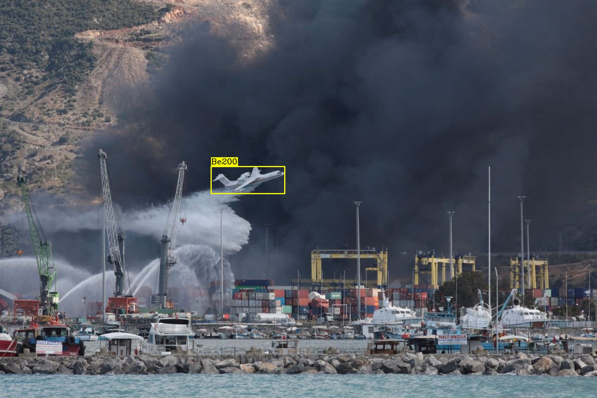
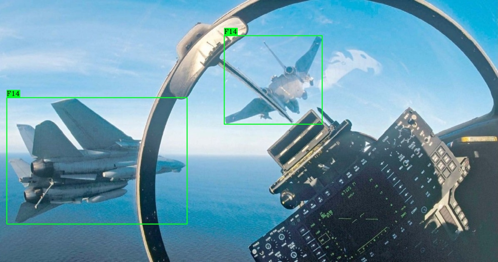
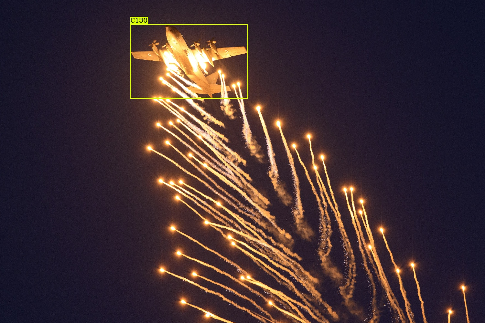

# Aerovision: Military Aircraft Detection using YOLO

This project is a real-time military aircraft detection system using the YOLO (You Only Look Once) object detection algorithm. It is capable of identifying various types of military aircraft from images and videos.

## Features

- Detects a wide range of military aircraft.
- Trained on a custom dataset of military aircraft images.
- Provides bounding box predictions for detected aircraft.
- Includes pre-trained YOLO models.

## Dataset

The dataset used for training is located in the `dataset/` directory and is structured for use with YOLO. It is split into `train`, `test`, and `val` sets. The images are in the `images/` directory and the corresponding labels are in the `labels/` directory.

The dataset was created by collecting images of various military aircraft and annotating them with bounding boxes.

## How to Use

1.  **Clone the repository:**
    ```bash
    git clone <repository-url>
    cd Aerovisio
    ```

2.  **Install dependencies:**
    This project requires Python and several libraries. You can install them using pip:
    ```bash
    pip install -r requirements.txt
    ```
    *(Note: You will need to create a `requirements.txt` file)*

3.  **Run detection:**
    You can use the `Military Aircraft Detection.ipynb` notebook to run detection on new images or videos. The notebook provides a step-by-step guide to loading the model and performing inference.

    Alternatively, you can use the command-line interface of YOLO to run detection:
    ```bash
    python detect.py --source <path-to-image-or-video> --weights best.pt
    ```

## Pre-trained Models

The pre-trained models are available in the root directory:
- `best.pt`: The best performing model on the validation set.
- `last.pt`: The model from the last training epoch.

## Results

Here are some sample detection results from the model:

| Image |
| :---: |
|  |
|  |
|  |

## Project Structure
```
.
├── Military Aircraft Detection.ipynb
├── best.pt
├── last.pt
├── README.md
├── .gitignore
├── dataset/
│   ├── train/
│   ├── test/
│   └── val/
└── runs/
    └── detect/
        └── ...
```

## To-Do

- [ ] Improve model accuracy by training on a larger dataset.
- [ ] Add support for real-time video stream detection.
- [ ] Create a web application to demonstrate the model.

